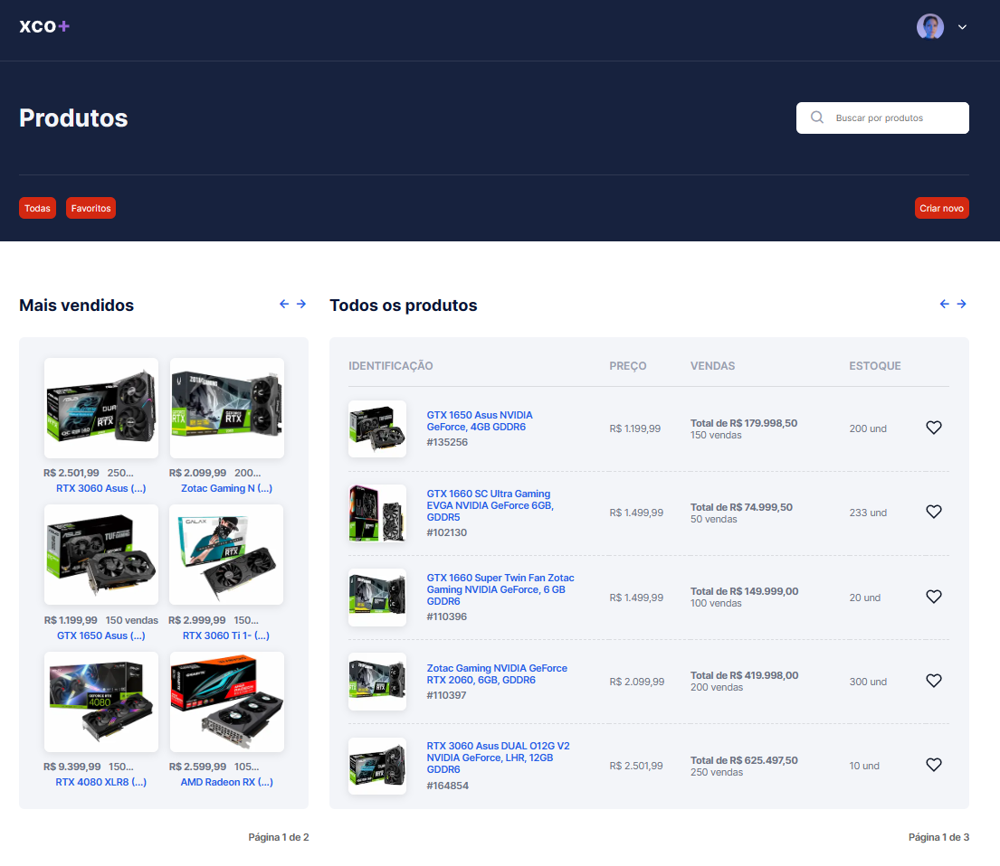
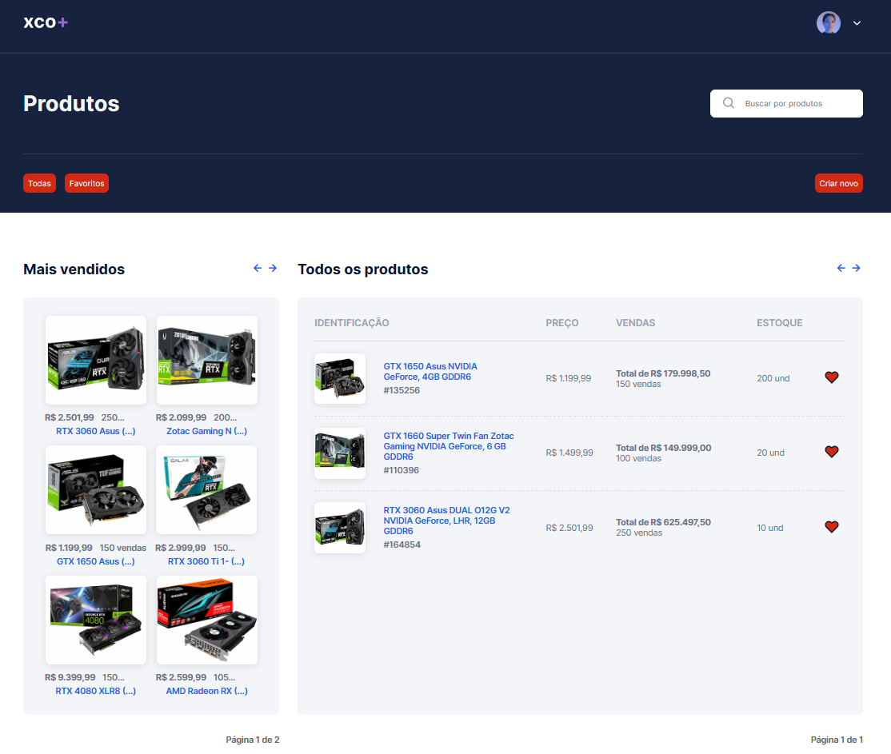
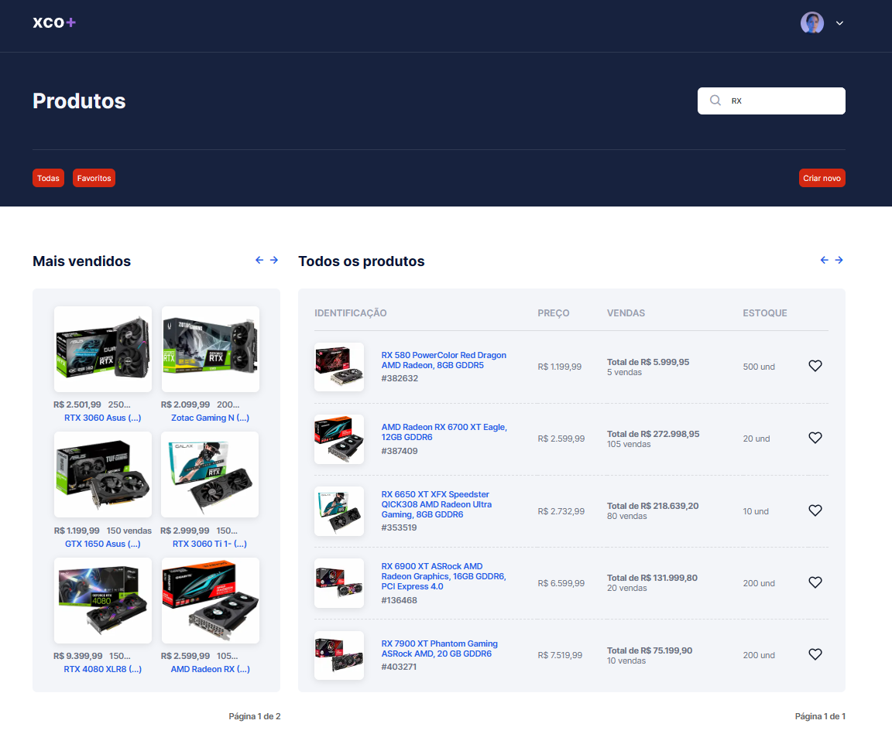
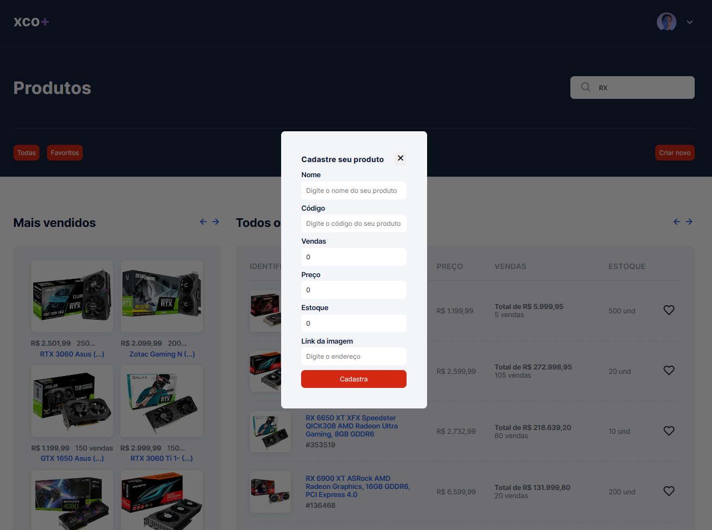

## Meu Portifólio

## Técnologias

Aqui estão as tecnológias utilizadas no projeto

* NextJS
* ReactJS
* TypeScript
* Stitches
* Zod
* MirageJS
* React toastify

## Getting started

* Dependencias
  - NextJS
  - ReactJS

* Para iniciar o projeto
  
### Primeiro
  - npm install
  or
  - yarn

### Segundo
 - npm run dev
 or
 - yarn dev 

## Como usar

### 1 - Quando você acessar verá a primeira e única página da aplicação onde você podera filtrar e favoritar produtos.

### 2 - Se clicar no botão de favoritos lá são listados todos os itens favoritados por você. Se quiser voltar ao normal apenas clique em "todos"

### 3 - Também pode filtrar utilizando a barra de pesquisa

### 4 - Cadastro de novos produtos 

## Features

As principais features do sistema são:
 - Filtrar os produtos pelo campo, e pelos botões.
 - Cadastro de novos produtos.

  ## Version

  1.0.

  ## Authors

  * **Valmir Mendes Virtuoso Filho** 

  Me siga no github e muito obrigado!
  Obrigado por ver o projeto!